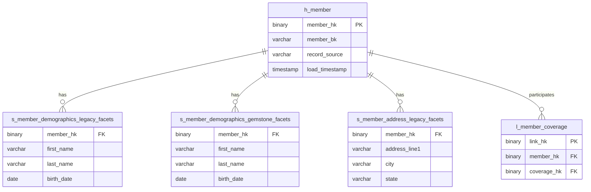

# Use Case 03: AI-Assisted Data Vault Code Generation

## Executive Summary

This use case focuses on leveraging AI to generate Data Vault 2.0 dbt code from high-level design specifications. Given a diagram or description of a hub-link-satellite aggregate (entity), the AI system will produce runnable dbt models following EDP platform architecture, naming conventions, and coding standards. This permanent capability accelerates development, ensures consistency, and reduces manual coding errors.

**Expected Benefit**: 60-80% reduction in initial code authoring time, improved consistency, reduced defects

---

## Business Context

### Problem Statement
Data Vault 2.0 development requires creating multiple related dbt models for each business entity:
- Hub for the business key
- Multiple satellites from different source systems
- Links to related hubs
- Staging models to prepare source data
- Tests for data quality validation

This repetitive work is time-consuming and error-prone when done manually. Small inconsistencies in naming, structure, or configuration can cause pipeline failures or test failures.

### Success Criteria
- Generate 80%+ complete, runnable dbt code from design specifications
- Code adheres to EDP naming conventions and standards
- Includes appropriate tests and documentation
- Reduces initial coding time by 60%+ for standard entities
- Maintains high quality (minimal manual corrections needed)

### Stakeholder Impact
- **Data Engineers**: Faster development, focus on complex business logic instead of boilerplate
- **Architects**: Consistent implementation of design patterns across teams
- **Project Management**: Accelerated delivery timelines for Data Vault migration

---

## Functional Requirements

### Core Capabilities

#### 1. Input: Data Vault Design Specification

**Supported Input Formats**:
- **Diagram**: Mermaid ERD or similar showing hub, links, satellites
- **Structured Text**: YAML/JSON describing entity structure
- **Narrative Description**: Plain English describing the business entity and relationships

**Required Information**:
- Business entity name (e.g., "Member", "Provider", "Claim")
- Business key(s) for the hub
- Source system(s) providing data
- Attribute groupings for satellites
- Relationships to other hubs (links)
- Source table mappings

**Example Input (YAML)**:
```yaml
entity:
  name: member
  description: "Health insurance member across all source systems"

hub:
  business_key:
    - member_id
  business_key_type: composite  # or simple
  sources:
    - legacy_facets
    - gemstone_facets

satellites:
  - name: demographics
    attributes:
      - first_name
      - last_name
      - birth_date
      - gender
      - ssn
    sources:
      - legacy_facets
      - gemstone_facets
    change_tracking: true

  - name: address
    attributes:
      - address_line1
      - address_line2
      - city
      - state
      - zip
    sources:
      - legacy_facets
      - gemstone_facets
    change_tracking: true

links:
  - name: member_coverage
    related_hub: coverage
    relationship_type: many_to_many
    sources:
      - legacy_facets
      - gemstone_facets

source_mappings:
  legacy_facets:
    schema: legacy_facets_history
    table: facets_member
    key_field: cmc_meme_ck
  gemstone_facets:
    schema: gemstone_facets_history
    table: gms_member
    key_field: member_id
```

**Example Input (Mermaid Diagram)**:


#### 2. Output: Complete dbt Project Structure

**Generated Artifacts**:

1. **Staging Models** (`models/staging/`)
   - One per source system
   - Rename source columns to standard names
   - Apply hashing for hash keys
   - Add record source metadata

2. **Hub Model** (`models/integration/hubs/`)
   - Combines all sources
   - Implements hub pattern using automate_dv
   - Business key deduplication

3. **Satellite Models** (`models/integration/satellites/`)
   - One per source system per satellite grouping
   - Change detection via hash_diff
   - Historization via load timestamps

4. **Link Models** (`models/integration/links/`)
   - Relationship tables between hubs
   - Many-to-many support
   - Multi-source links

5. **Test Definitions** (`models/integration/*/schema.yml`)
   - Uniqueness tests on hash keys
   - Not-null tests on required fields
   - Referential integrity tests
   - Custom business rule tests

6. **Documentation** (`models/integration/*/schema.yml`)
   - Entity descriptions
   - Column descriptions
   - Business context

**Example Generated Code**:

```sql
-- models/staging/legacy_facets/stg_member_legacy_facets.sql
{{ config(
    materialized='view'
) }}


{%- set derived_columns = automate_dv.derived_columns(
    source_model=source_model,
    hashed_columns={
        'member_hk': {
            'columns': ['cmc_meme_ck'],
            'is_hashdiff': false
        },
        'member_demographics_hashdiff': {
            'columns': [
                'first_name',
                'last_name',
                'birth_date',
                'gender'
            ],
            'is_hashdiff': true
        }
    },
    derived_columns={
        'record_source': "'legacy_facets'",
        'load_timestamp': 'load_timestamp'
    }
) -%}

SELECT
    -- Business key
    cmc_meme_ck AS member_bk,

    -- Demographics attributes
    first_name,
    last_name,
    birth_date,
    gender,

    -- Derived columns (hash keys, metadata)
    {{ derived_columns }}

FROM {{ source_model }}
```

```sql
-- models/integration/hubs/h_member.sql
{{ config(
    materialized='incremental',
    unique_key='member_hk'
) }}



{{ automate_dv.hub(
    src_pk='member_hk',
    src_nk='member_bk',
    src_ldts='load_timestamp',
    src_source='record_source',
    source_model=source_models
) }}
```

```sql
-- models/integration/satellites/s_member_demographics_legacy_facets.sql
{{ config(
    materialized='incremental',
    unique_key='member_hk'
) }}









{{ automate_dv.sat(
    src_pk=src_pk,
    src_hashdiff=src_hashdiff,
    src_payload=src_payload,
    src_eff=src_eff,
    src_ldts=src_ldts,
    src_source=src_source,
    source_model=source_model
) }}
```

```yaml
# models/integration/hubs/schema.yml
version: 2

models:
  - name: h_member
    description: "Hub table for Member entity across all source systems"
    columns:
      - name: member_hk
        description: "Hash key for member (surrogate key)"
        tests:
          - unique
          - not_null
      - name: member_bk
        description: "Business key for member (natural key)"
        tests:
          - not_null
      - name: record_source
        description: "Source system providing this record"
      - name: load_timestamp
        description: "Timestamp when record was loaded to hub"
```

#### 3. Validation and Testing

**Pre-Generation Validation**:
- Check for conflicting naming conventions
- Validate source table mappings exist
- Verify business key uniqueness across sources
- Confirm automate_dv compatibility

**Post-Generation Validation**:
- Syntax check all generated SQL
- Compile dbt models (dry-run)
- Verify test definitions are valid
- Ensure naming conventions followed

**Generated Test Suite**:
```yaml
# Automatically generated tests
tests:
  # Hub tests
  - unique: [member_hk]
  - not_null: [member_hk, member_bk]

  # Satellite tests
  - relationships:
      to: ref('h_member')
      field: member_hk
  - not_null: [member_hk, load_timestamp, hash_diff]

  # Link tests
  - unique: [link_hk]
  - relationships:
      to: ref('h_member')
      field: member_hk
  - relationships:
      to: ref('h_coverage')
      field: coverage_hk
```

---

## Technical Constraints

### Architecture Alignment

**Layer Compliance**:
- Generated code must target Integration Layer only
- Staging models reference Raw Layer sources
- Hub/Link/Satellite models materialized in Integration Layer schemas

**Data Vault Standards**:
- Strict adherence to Data Vault 2.0 patterns
- Multi-source satellite pattern (one satellite per source)
- No business logic in Raw Vault (that's for Business Vault)
- Full historization with load timestamps

### Performance Expectations

**Code Generation Speed**:
- Simple entity (1 hub, 2 satellites): <30 seconds
- Complex entity (1 hub, 5 satellites, 3 links): <2 minutes

**Generated Code Performance**:
- Incremental models for all Data Vault artifacts
- Efficient hashing using MD5/SHA-256
- Minimal joins in staging layer
- Optimized for Snowflake execution

### Integration Points

**dbt Platform Integration**:
- Compatible with dbt 1.5+
- Uses automate_dv package (datavault4dbt)
- Follows dbt best practices (ref/source functions, config blocks)

**Source System Integration**:
- References existing raw layer schemas
- Handles multiple source systems per entity
- Supports CDC metadata from raw layer

**Version Control**:
- Generated code committed to GitLab
- Follows branch/merge workflow
- Includes generation metadata in comments

---

## Implementation Guidance for AI

### Code Patterns

**File Organization**:
```
models/
├── staging/
│   ├── {source_system}/
│   │   ├── stg_{entity}_{source_system}.sql
│   │   └── schema.yml
│   └── ...
├── integration/
│   ├── hubs/
│   │   ├── h_{entity}.sql
│   │   └── schema.yml
│   ├── links/
│   │   ├── l_{relationship}.sql
│   │   └── schema.yml
│   └── satellites/
│       ├── s_{entity}_{attribute_group}_{source_system}.sql
│       └── schema.yml
└── ...
```

**Naming Conventions**:
- **Staging**: `stg_{entity}_{source_system}`
- **Hub**: `h_{entity}`
- **Link**: `l_{relationship}` (e.g., `l_member_coverage`)
- **Satellite**: `s_{entity}_{attribute_group}_{source_system}`
- **Hash Keys**: `{entity}_hk` for hubs, `{relationship}_hk` for links
- **Business Keys**: `{entity}_bk`
- **Hash Diff**: `{attribute_group}_hashdiff`

**Metadata Standards**:
```sql
-- Generated by: AI Data Vault Code Generator
-- Entity: {entity_name}
-- Source Systems: {source_list}
-- Generated Date: {timestamp}
-- Design Specification: {link_to_input}
```

### Testing Approach

**Tiered Testing Strategy**:

1. **Tier 1: Structural Tests** (always generated)
   - Uniqueness of hash keys
   - Not-null on required fields
   - Referential integrity (FK relationships)

2. **Tier 2: Data Vault Pattern Tests** (always generated)
   - Hub: Business key not null
   - Satellite: Hash diff captures changes
   - Link: Both hub FKs exist

3. **Tier 3: Business Rule Tests** (conditionally generated)
   - Based on input specifications
   - Custom SQL for domain-specific rules
   - Optional: generated as templates for manual completion

**Example Test Generation**:
```yaml
# Tier 1: Structural
tests:
  - dbt_utils.unique_combination_of_columns:
      combination_of_columns:
        - member_hk
        - load_timestamp

# Tier 2: Data Vault Pattern
  - automate_dv.hub_has_all_sources:
      sources: ['legacy_facets', 'gemstone_facets']

# Tier 3: Business Rule (template)
  - custom.validate_member_age:
      min_age: 0
      max_age: 120
```

### Documentation Updates

**Auto-Generated Documentation Sections**:
- Entity overview and business purpose
- Source system mappings
- Business key composition
- Attribute grouping rationale
- Relationship descriptions

**Example**:
```yaml
models:
  - name: h_member
    description: |
      ## Member Hub

      **Business Entity**: Health insurance member across all source systems

      **Business Key**: member_id (composite of source-specific identifiers)

      **Source Systems**:
      - Legacy FACETS (cmc_meme_ck)
      - Gemstone FACETS (member_id)

      **Related Entities**:
      - Coverage (via l_member_coverage)
      - Claim (via l_claim_member)
      - Provider (via l_member_pcp)

      **Generated**: 2025-10-01 by AI Data Vault Code Generator
```

---

## AI Workflow Integration

### Workflow Steps

```
┌─────────────────────────────────────────────────────────────────┐
│              AI Data Vault Code Generation Workflow             │
├─────────────────────────────────────────────────────────────────┤
│                                                                 │
│  1. Architect Creates Design Specification                      │
│     ↓                                                           │
│  2. AI Parses Input (diagram/YAML/text)                         │
│     ↓                                                           │
│  3. AI Validates Design Completeness                            │
│     ↓                                                           │
│  4. AI Generates dbt Project Structure                          │
│     ↓                                                           │
│  5. AI Generates Staging Models                                 │
│     ↓                                                           │
│  6. AI Generates Hub/Link/Satellite Models                      │
│     ↓                                                           │
│  7. AI Generates Tests and Documentation                        │
│     ↓                                                           │
│  8. AI Validates Generated Code (syntax, compile)               │
│     ↓                                                           │
│  9. Developer Reviews and Refines                               │
│     ↓                                                           │
│  10. Commit to GitLab and Deploy                                │
│                                                                 │
└─────────────────────────────────────────────────────────────────┘
```

### Automation Triggers

**When to Apply**:
- New business entity identified in architecture
- Existing entity being refactored to Data Vault
- Additional source system added to existing entity

**Input Requirements**:
- Entity design specification (YAML/diagram/text)
- Source table schemas available in raw layer
- Target layer and schema names
- EDP naming convention rules

**Expected Outputs**:
- Complete dbt model files (.sql)
- Test definitions (schema.yml)
- Documentation (schema.yml)
- Generation report (summary of what was created)
- Validation report (syntax checks, compile results)

---

## Comparison to Related Use Cases

### UC01: 3NF to Data Vault Refactoring
**Difference**: UC01 starts with existing 3NF code and refactors it. UC03 starts from scratch with design specifications.

**Overlap**: Both generate Data Vault artifacts using automate_dv.

**Usage**: Use UC01 for migration work, UC03 for new entity development.

### UC02: EDW Stored Procedure Translation
**Difference**: UC02 translates business logic from SQL Server to dbt. UC03 generates raw vault structures without business logic.

**Overlap**: Both generate dbt code following EDP standards.

**Usage**: Use UC02 for business vault/dimensional models, UC03 for raw vault structures.

### Combined Workflow
```
UC03: Generate Raw Vault Structures
    ↓
UC02: Translate Business Logic into Business Vault
    ↓
UC01: Refactor Legacy 3NF (if needed)
    ↓
Manual: Complex business rules and optimizations
```

---

## Success Metrics

### Quantitative Metrics
- **Code Generation Accuracy**: % of generated code that compiles without changes (target: 85%+)
- **Time Savings**: Hours saved per entity vs. manual coding (target: 60%+)
- **Defect Reduction**: Fewer test failures in generated code vs. manual (target: 40% reduction)
- **Consistency Score**: % adherence to naming/pattern standards (target: 95%+)

### Qualitative Metrics
- Developer satisfaction with generated code quality
- Architect confidence in pattern consistency
- Ease of customization after generation

### Continuous Improvement
- Track common manual corrections → improve generation templates
- Monitor edge cases → expand input validation
- Collect developer feedback → refine code patterns

---

## Implementation Roadmap

### Phase 1: Prototype (2-4 weeks)
- [ ] Define input specification schema (YAML)
- [ ] Build parser for design specifications
- [ ] Create code generation templates for staging models
- [ ] Generate hub models using automate_dv
- [ ] Validate with 2-3 simple entities

### Phase 2: Core Capabilities (4-6 weeks)
- [ ] Generate satellite models (multi-source pattern)
- [ ] Generate link models
- [ ] Auto-generate test definitions
- [ ] Auto-generate documentation
- [ ] Support Mermaid diagram input
- [ ] Validate with 5-7 entities of varying complexity

### Phase 3: Production Readiness (4-6 weeks)
- [ ] Comprehensive validation (syntax, compile, test)
- [ ] Error handling and user feedback
- [ ] Integration with GitLab workflow
- [ ] Developer training and documentation
- [ ] Pilot with data engineering team
- [ ] Refinement based on feedback

### Phase 4: Continuous Improvement (ongoing)
- [ ] Template library expansion
- [ ] Edge case handling
- [ ] Performance optimizations
- [ ] Integration with architecture tools
- [ ] Metrics collection and reporting

---

## Evaluation Criteria

### Must Have
- [ ] Generate syntactically correct dbt code from YAML specifications
- [ ] Support hub, link, satellite generation using automate_dv
- [ ] Follow EDP naming conventions consistently
- [ ] Include basic tests (unique, not_null, relationships)
- [ ] Compile successfully in dbt
- [ ] Support multiple source systems per entity

### Should Have
- [ ] Parse Mermaid diagram input
- [ ] Generate comprehensive test suites
- [ ] Auto-generate documentation with business context
- [ ] Validate source table mappings exist
- [ ] Provide generation reports and validation results
- [ ] Support custom configuration options

### Nice to Have
- [ ] GUI for design specification input
- [ ] Visual preview of generated Data Vault structure
- [ ] Integration with data modeling tools
- [ ] Version control of design specifications
- [ ] Automated deployment to dev environment

---

## Related Documentation

- [Data Vault 2.0 Guide](../../engineering-knowledge-base/data-vault-2.0-guide.md)
- [EDP Layer Architecture](../../architecture/edp-layer-architecture-detailed.md)
- [automate_dv Package Documentation](https://automate-dv.readthedocs.io/)
- [dbt Best Practices](https://docs.getdbt.com/guides/best-practices)

---

**Document Version**: 1.0
**Author**: Dan Brickey
**Last Updated**: 2025-10-01
**Status**: Planned - Not yet implemented
