# Agentic Workflow Specification: BCI Data Vault Design & Implementation

**Organization**: Blue Cross of Idaho (BCI)
**Version**: 1.0
**Created**: 2026-01-03

## Workflow Overview

| Attribute | Value |
|-----------|-------|
| **Trigger** | Business need for new data entity or refactor of existing Data Vault structure |
| **Outcome** | Approved, tested dbt code merged to develop branch in GitLab |
| **Total Steps** | 9 |
| **Agent Steps** | 1 🤖 |
| **Human Steps** | 4 👤 |
| **Hybrid Steps** | 4 🔄 |
| **Estimated Improvement** | 40-60% reduction in architecture phase time (Steps 2-4) |

## Runtime Environment

| Tool | Role | Notes |
|------|------|-------|
| **Amazon Q (VSCode)** | Primary orchestrator - runs agent prompts | Receives portable prompts designed in Cursor |
| **dbt Copilot** | dbt model generation | Receives prompts generated by Amazon Q |
| **Lucidchart** | Diagramming | Human creates/updates; agent validates against spec |
| **GitLab** | Code review, merge | Human-owned process |

## Workflow Diagram

```mermaid
flowchart TD
    A[👤 Trigger: Business Need Identified] --> B[🔄 Design Entity]
    B --> C{👤 Checkpoint: Design Decision}
    C -->|Approved| D[🔄 Create Diagram]
    C -->|Rejected| B
    D --> E[🔄 Write Specification]
    E --> F{👤 Checkpoint: Spec Review}
    F -->|Approved| G[👤 Assign to Engineer]
    F -->|Needs Work| E
    G --> H[🤖 Implement in dbt]
    H --> I[👤 Submit MR]
    I --> J[🔄 Review Code]
    J --> K{👤 Checkpoint: Code Approval}
    K -->|Approved| L[👤 Merge to Develop]
    K -->|Rejected| H
    L --> M[Done: Code in Develop]
```



## Step-by-Step Flow

| Step | Type | Performer | Description | Checkpoint |
|------|------|-----------|-------------|------------|
| 1 | 👤 | Architect / Stakeholder | Identify business need, define scope | |
| 2 | 🔄 | @design-advisor → Architect | Agent suggests DV structure; architect decides | ✓ Design Decision |
| 3 | 🔄 | Architect + @diagram-validator | Architect creates diagram; agent validates structure | |
| 4 | 🔄 | @spec-generator → Architect | Agent drafts spec from design; architect reviews/refines | ✓ Spec Review |
| 5 | 👤 | Architect / Lead | Assign work to engineer | |
| 6 | 🤖 | @dbt-prompt-builder → dbt Copilot | Agent generates prompt; dbt Copilot creates code | |
| 7 | 👤 | Data Engineer | Submit MR to GitLab | |
| 8 | 🔄 | @code-evaluator → Reviewer | Agent pre-scans for spec compliance; human reviews | ✓ Code Approval |
| 9 | 👤 | Reviewer | Merge approved code to develop | |

---

## Human-in-the-Loop Details

### Step 2: Design Decision Checkpoint

| Attribute | Value |
|-----------|-------|
| **Location** | After Step 2 |
| **Type** | Approval Gate |
| **Performer** | Architect |
| **Purpose** | Validate DV structure before proceeding to diagram/spec |
| **Inputs** | Agent's design suggestion with rationale |
| **Approval Criteria** | Structure appropriate for business need; follows DV 2.0 patterns |
| **If Approved** | Proceed to Step 3 (Create Diagram) |
| **If Rejected** | Provide feedback; agent refines suggestion |
| **Expected Duration** | 15-30 minutes |

### Step 4: Spec Review Checkpoint

| Attribute | Value |
|-----------|-------|
| **Location** | After Step 4 |
| **Type** | Review + Refinement |
| **Performer** | Architect |
| **Purpose** | Ensure spec is complete and accurate before engineering |
| **Inputs** | Generated specification (markdown) |
| **Approval Criteria** | All sections complete; business keys correct; column mappings accurate; acceptance criteria testable |
| **If Approved** | Proceed to Step 5 (Assign to Engineer) |
| **If Needs Work** | Architect edits directly or provides feedback for regeneration |
| **Expected Duration** | 30-60 minutes (vs. 4-8 hours manual) |

### Step 8: Code Approval Checkpoint

| Attribute | Value |
|-----------|-------|
| **Location** | After Step 8 |
| **Type** | Approval Gate |
| **Performer** | Architect / Lead Engineer |
| **Purpose** | Validate code matches spec and meets standards |
| **Inputs** | Code evaluation report from agent; MR diff |
| **Approval Criteria** | Agent reports no deviations; human spot-check passes; tests pass |
| **If Approved** | Proceed to Step 9 (Merge) |
| **If Rejected** | Return to Step 6 with specific feedback |
| **Expected Duration** | 15-30 minutes (vs. 1-2 hours manual) |

---

## Agent Summary

| Agent | Step | Purpose | Input | Output |
|-------|------|---------|-------|--------|
| @design-advisor | 2 | Suggest DV structure from source analysis | Source docs, existing model info | Design recommendation with rationale |
| @diagram-validator | 3 | Validate diagram matches design intent | Diagram description, design decision | Validation report or issues |
| @spec-generator | 4 | Generate structured specification | Design decision, source metadata | Complete spec (markdown) |
| @dbt-prompt-builder | 6 | Generate prompt for dbt Copilot | Specification | dbt Copilot prompt |
| @code-evaluator | 8 | Compare code against spec | MR code, specification | Compliance report |

---

## Bottleneck Impact Analysis

### Before (Current State)

```
Design & Spec (Steps 2-4):  ████████████████████░░░░  ~60-70% of cycle time
Implementation (Steps 5-7): ██████░░░░░░░░░░░░░░░░░░  ~20-25% of cycle time
Review & Merge (Steps 8-9): ████░░░░░░░░░░░░░░░░░░░░  ~10-15% of cycle time
```

### After (Projected)

```
Design & Spec (Steps 2-4):  ████████░░░░░░░░░░░░░░░░  ~25-35% of cycle time ← PRIMARY WIN
Implementation (Steps 5-7): ██████░░░░░░░░░░░░░░░░░░  ~20-25% of cycle time
Review & Merge (Steps 8-9): ██░░░░░░░░░░░░░░░░░░░░░░  ~5-10% of cycle time ← SECONDARY WIN
```

### Key Improvements

| Metric | Before | After | Improvement |
|--------|--------|-------|-------------|
| Spec creation time | 4-8 hours | 30-60 min | ~80% reduction |
| Review time | 1-2 hours | 15-30 min | ~75% reduction |
| Spec completeness | Variable | Consistent | Reduced rework |
| Design-to-code alignment | Manual verification | Automated checks | Fewer review cycles |

---

## Implementation Phases

### Phase A: Core Agents (High Impact)

1. **@spec-generator** - Highest value; addresses primary bottleneck
2. **@dbt-prompt-builder** - Enables consistent handoff to dbt Copilot

### Phase B: Validation Agents (Quality)

3. **@code-evaluator** - Accelerates review; catches issues early
4. **@diagram-validator** - Ensures diagram-spec alignment

### Phase C: Design Assistance (Advanced)

5. **@design-advisor** - Requires more context; implement after patterns established

---

## Next Steps

1. Create detailed agent specifications (see `agents/` folder)
2. Build portable prompts for Amazon Q
3. Test with real BCI use cases
4. Iterate based on effectiveness tracking (see `sync/CONTEXT_SYNC.md`)

